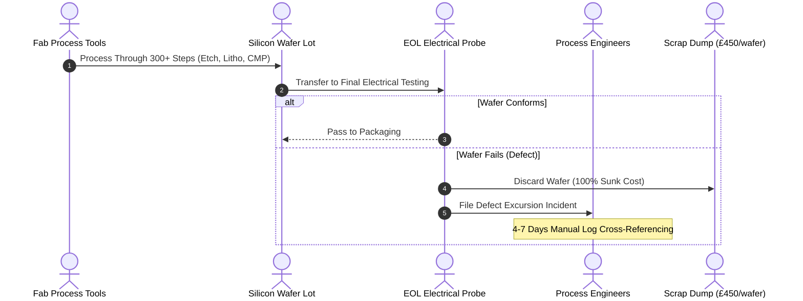
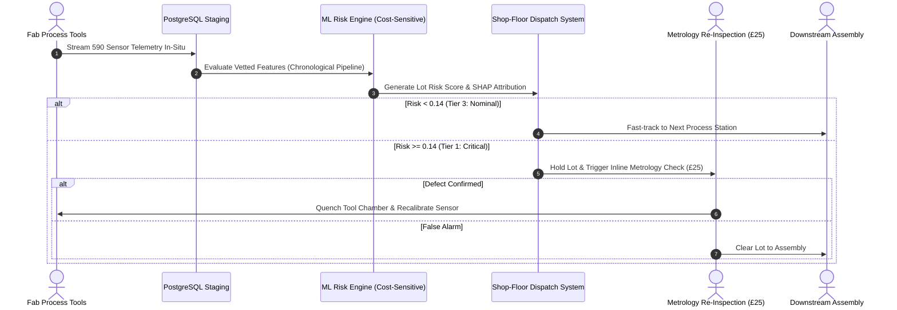

# Digital Transformation: Current-State vs. Future-State Process Mapping
## Manufacturing Operations Intelligence Platform

---

## 1. Executive Summary

This architecture specification documents the operational transition from a **reactive, post-mortem semiconductor quality control model** to an **in-situ, predictive Operations Intelligence Platform**.

---

## 2. Current-State Operational Process (Reactive Fab)

### Characteristics
* **End-of-Line (EOL) Detection:** Defective wafers are only identified at final electrical wafer probe, after 100% of processing and raw material costs have been sunk.
* **Siloed Metrology:** Sensor telemetry from 500+ chamber instruments is stored in disparate equipment logs without centralized data quality audits.
* **Delayed Root-Cause Investigation:** When scrap spikes occur, cross-functional engineering teams spend 4–7 days manually cross-referencing sensor logs.

---

## 3. Future-State Operational Process (Predictive Operations Intelligence)

### Capabilities
* **In-Situ Risk Scoring:** Sensor telemetry is ingested and profiled immediately; wafers with elevated defect probability are identified at Step 30 rather than Step 300.
* **Automated 3-Tier Lot Dispatch:**
  * **Tier 1 (Critical):** Immediate automated hold and inline metrology review.
  * **Tier 2 (Elevated):** Chamber drift notification to prevent tool excursion.
  * **Tier 3 (Nominal):** Fast-tracked through downstream bottlenecks.
* **Explainable Root Cause (SHAP):** Technicians receive specific sensor attributions (e.g., *Attribute 578: Plasma RF Matching*) immediately on their terminal or Power BI cockpit.

---

## 4. Operational & Economic Impact Summary

| Dimension | Current-State (Traditional Fab) | Future-State (Platform Enabled) | Operational Benefit |
|:---|:---|:---|:---|
| **Defect Detection Point** | Final Electrical Probe (End of Line) | In-Situ Process Stages (Chambers 1–60) | **90% reduction in wasted downstream processing** |
| **Defect Inspection Cost** | £450 per scrapped wafer | £25 inline metrology re-check | **34.97% direct Cost-of-Quality (CoQ) reduction** |
| **Data Quality Governance** | Silent missing values and sensor drift | Automated quarantine (>50% missing & constant) | **Zero silent pipeline failures** |
| **Root-Cause Latency** | 4–7 days post-incident review | Real-time SHAP feature attribution | **Immediate corrective action on chamber recipes** |
| **Inventory Planning** | Static buffer based on average yield | Dynamic safety stock driven by 14-day forecast | **Lower carrying costs and zero stock-outs** |
