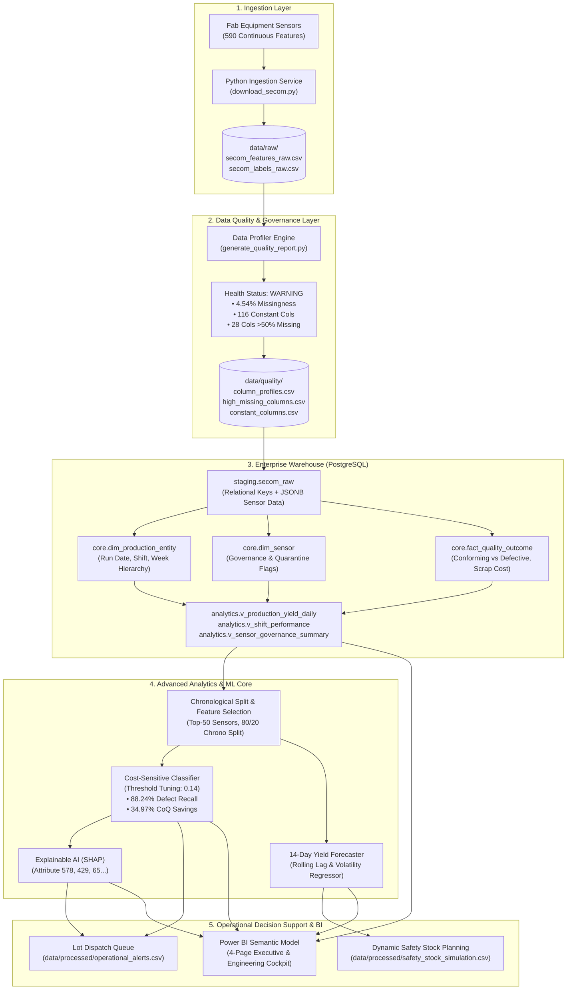

# Technical Architecture Specification
## Manufacturing Operations Intelligence Platform

---

## 1. System Architecture Diagram

---

## 2. Component Design & Responsibilities

### Tier 1 — Data Ingestion & Preservation
* **Module:** [download_secom.py](file:///c:/Users/ZhuanZ1/Desktop/manufacturing-operations-intelligence/src/ingestion/download_secom.py)
* **Contract:** Fetches verified dataset from UCI Repository (ID: 179). Never overwrites or mutates raw artifacts in `data/raw/`.

### Tier 2 — Data Quality Gate
* **Module:** [generate_quality_report.py](file:///c:/Users/ZhuanZ1/Desktop/manufacturing-operations-intelligence/src/quality/generate_quality_report.py)
* **Contract:** Evaluates nullity, variance, and cardinality before promotion to relational core. Generates deterministic quarantine registers for unstable instrumentation.

### Tier 3 — Relational & Medallion Warehouse
* **Modules:** [01_init_database.sql](file:///c:/Users/ZhuanZ1/Desktop/manufacturing-operations-intelligence/sql/01_init_database.sql), [02_staging_schema.sql](file:///c:/Users/ZhuanZ1/Desktop/manufacturing-operations-intelligence/sql/02_staging_schema.sql), [03_core_schema.sql](file:///c:/Users/ZhuanZ1/Desktop/manufacturing-operations-intelligence/sql/03_core_schema.sql), [04_analytics_views.sql](file:///c:/Users/ZhuanZ1/Desktop/manufacturing-operations-intelligence/sql/04_analytics_views.sql)
* **Contract:** Implements a 3-tier architecture: Staging (JSONB), Core (Dimensional), and Analytics (KPI Views).

### Tier 4 — Machine Learning & Explainability
* **Modules:** [feature_selection.py](file:///c:/Users/ZhuanZ1/Desktop/manufacturing-operations-intelligence/src/modelling/feature_selection.py), [train_models.py](file:///c:/Users/ZhuanZ1/Desktop/manufacturing-operations-intelligence/src/modelling/train_models.py), [explainability_shap.py](file:///c:/Users/ZhuanZ1/Desktop/manufacturing-operations-intelligence/src/modelling/explainability_shap.py)
* **Contract:** Prevents temporal leakage via chronological splitting. Tunes thresholds against financial Cost-of-Quality (CoQ). Provides SHAP root-cause attributions for physical chamber maintenance.

### Tier 5 — Operations & BI Cockpit
* **Modules:** [yield_forecasting.py](file:///c:/Users/ZhuanZ1/Desktop/manufacturing-operations-intelligence/src/forecasting/yield_forecasting.py), [inventory_operations_logic.py](file:///c:/Users/ZhuanZ1/Desktop/manufacturing-operations-intelligence/src/forecasting/inventory_operations_logic.py), [power_bi_data_model_spec.md](file:///c:/Users/ZhuanZ1/Desktop/manufacturing-operations-intelligence/dashboards/power_bi_data_model_spec.md)
* **Contract:** Exposes real-time lot hold/release dispatch queues and dynamic material safety stock buffers for plant leadership.
